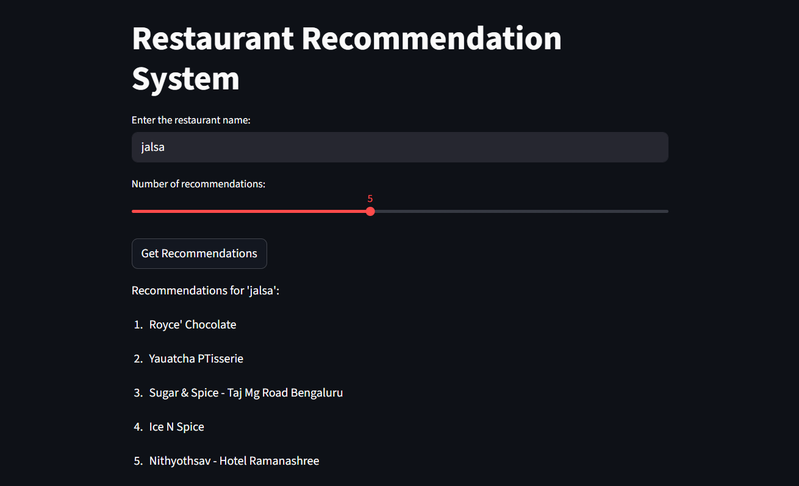
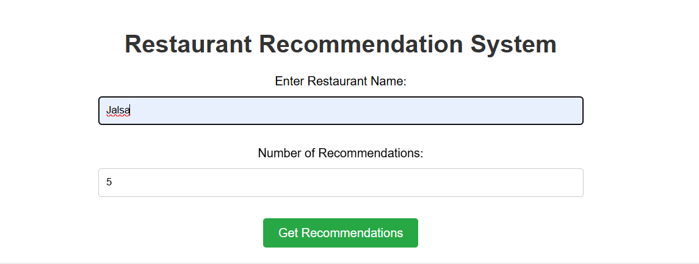
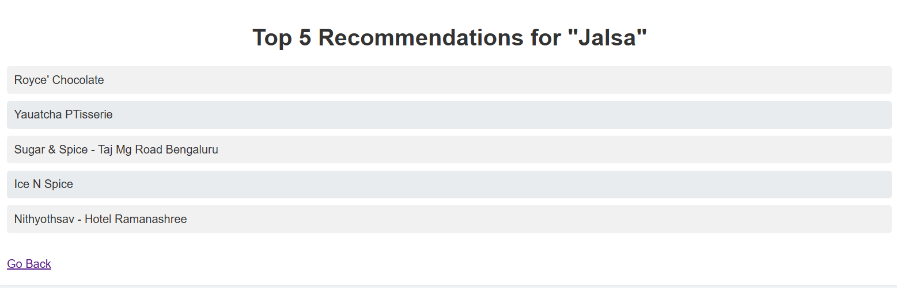

# Restaurant Recommendation System 🍽️

A content-based filtering system that recommends restaurants from the Zomato dataset based on similarity of features like cuisine, cost, and location. This project includes an interactive web application built with Streamlit and a potential API endpoint.

## ✨ Features

- **Content-Based Filtering**: Recommends restaurants by comparing item attributes.
- **Data-Driven**: Built on a cleaned and processed Zomato dataset.
- **Interactive UI**: A user-friendly web interface created with Streamlit to easily get recommendations.
- **Reproducible Workflow**: Jupyter notebooks detailing the entire process from EDA to model evaluation.
- **Containerized**: Docker support for easy deployment and scalability.


# 📂 Project Structure
The repository is organized as follows:

```vbnet
├── app/ 
│ ├── templates/ 
│ │ ├── index.html
│ │ └── recommendations.html
│ ├── app.py 
│ └── streamlit.py 
│
├── data/ 
│ ├── clean_data.csv
│ ├── clean_zomato.csv
│ └── zomato.csv 
│
├── models/ 
│ ├── cosine_sim.pkl 
│ ├── df_sample.pkl 
│ └── get_content_based_recommendation.py
│
├── output/ 
│ └── evaluation.txt
│
├── .gitignore 
├── 01_eda.ipynb 
├── 02_feature_engineering.ipynb  Engineering
├── 03_model_training.ipynb 
├── 04_evaluation.ipynb 
├── docker-compose.yaml 
├── Dockerfile 
├── README.md 
└── requirements.txt 
```
# 🚀 Quick Start: Installation & Setup

Follow these steps to get the project up and running on your local machine.

## 1. Clone the Repository
Clone this repository to your local machine using Git:

```bash
git clone https://github.com/abubinfahd/Restaurant-Recommendation-Project.git
cd restaurant-recommendation-system
```
## 2. Create and Activate a Python Virtual Environment
It's highly recommended to use a virtual environment to manage project dependencies.

```bash
python -m venv venv
.\venv\Scripts\activate
```
## 3. Install Dependencies
Install all the required Python libraries listed in `requirements.txt.`

```bash
pip install -r requirements.txt
```
# 🏃‍♂️ Usage

You can run the application in three different ways: as a Streamlit app, as an API, or using Docker.

## Method 1: Run the Streamlit App (Recommended)
This is the easiest way to interact with the recommendation system.

1. Navigate to the project's root directory.
2. Run the following command in your terminal:

```bash
streamlit run app/streamlit.py
```
3. Open your web browser and go to `http://localhost:8501`



## Method 2: Run the API

If you want to interact with the recommendation engine through an API (e.g., for integration with another application), you can run the Flask app.

1. Run the `app.py` script:

```bash
python app/app.py
```
2. The API will be available at `http://127.0.0.1:5000`




## Method 3: Run with Docker

For a more isolated and reproducible environment, use Docker and Docker Compose.

1. Build the Docker image:
```bash
docker-compose build
```
2. Build the Docker image by running the following command:
```bash
docker-compose up
```
3. The Streamlit application will be accessible at `http://localhost:8501`

# 📊 Project Overview

This project implements a content-based filtering approach for recommending restaurants based on their features such as cuisine, cost, location, and type of restaurant.

## Data Preprocessing
The initial `zomato.csv` dataset is cleaned and processed:
- Missing values are handled.
- Key features like **cuisines**, **reviw**, **cost**, and **location** are selected for further analysis.

## Feature Engineering
The textual features (e.g., **cuisines**, **review**) are combined into a single "content" string for each restaurant. This string is then converted into a numerical representation using **TF-IDF Vectorization**, which transforms the textual data into a format that can be processed by machine learning algorithms.

## Similarity Calculation
The **Cosine Similarity** metric is used to calculate the similarity between all pairs of restaurants based on their vectorized features. The resulting similarity matrix is saved in `models/cosine_sim.pkl` for future reference.

## Recommendation Generation
When a user selects a restaurant, the system:
- Looks up its pre-calculated similarity scores with all other restaurants.
- Returns the top N most similar restaurants as recommendations.


These guidelines will help you run the application.
